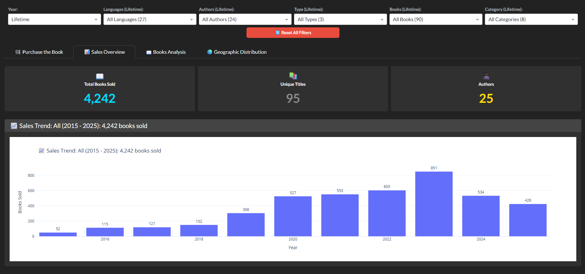

# Resulam Sales Analytics Platform

A modern, interactive multi-page dashboard for analyzing book sales and royalties data from Amazon KDP.

**Live Demo:** https://resulam-royalties.tchamna.com/

## 🚀 Quick Start

```bash
# Install dependencies
pip install -r requirements.txt

# Run the dashboard
python main.py

# Access the dashboards
# Public: http://localhost:8050/
# Authors: http://localhost:8050/authors
```

## 🌐 Dashboard Routes

- **Public Dashboard (`/`)**: Customer-facing interface with lifetime sales overview
- **Authors Dashboard (`/authors`)**: Internal analytics with comprehensive data and filtering

## 📁 Documentation

For detailed documentation, setup instructions, and feature descriptions, see:
- [Complete Documentation](docs/README.md)
- [Deployment Guide](docs/deployment/DEPLOYMENT.md)
- [Setup Checklist](docs/deployment/SETUP_CHECKLIST.md)

## Preview



## 🎯 Features

- **Multi-Page Architecture**: Separate public and internal dashboards
- **Interactive Analytics**: Advanced filtering and visualizations
- **Dynamic Titles**: Chart/section titles reflect active filters
- **Real-time Data**: Live exchange rate integration
- **Export Capabilities**: CSV data export functionality
- **Responsive Design**: Modern Bootstrap-based UI
- **Cloud Integration**: Optional S3 data synchronization

## 🔧 Technical Stack

- Python 3.11+, Pandas, Plotly, Dash
- Flask routing, Bootstrap UI
- Live exchange rate API integration
- Optional AWS S3 integration

## 📄 License

Proprietary software for Resulam Books.

---

Built with ❤️ for Resulam Books

## Chatbot (Optional)

The public dashboard includes a lightweight book chatbot. It defaults to a free local
LLM via Ollama (if running) and falls back to keyword search when unavailable.

Set any of these environment variables to customize:
- `CHATBOT_USE_LLM=true`
- `CHATBOT_LLM_PROVIDER=ollama`
- `CHATBOT_OLLAMA_URL=http://localhost:11434`
- `CHATBOT_LLM_MODEL=llama3.2:3b`
- `CHATBOT_RESULT_LIMIT=12`
- `CHATBOT_RAG_ENABLED=true`
- `CHATBOT_RAG_INDEX_PATH=data/chatbot_rag_index.pkl`
- `CHATBOT_RAG_TOP_K=30`
